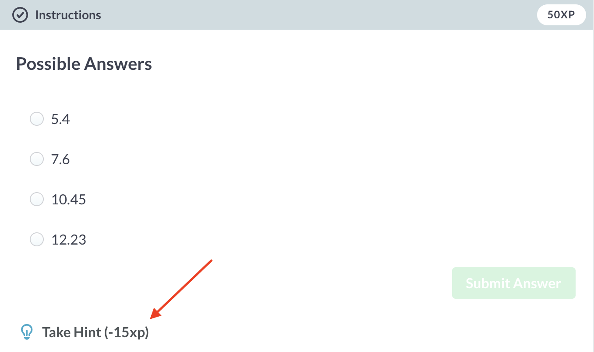

# Getting help

## Using hints

I've noticed that some students are really concerned about taking hints in DataCamp. I want to reiterate here that **hints are meant to be a resource to help you learn -- they are not meant to be punitive**. Having said that, I understand why you are concerned about the impact using hints may have on your grade. Hopefully, the following example will help alleviate some of those concerns. 

> In general, hints are worth 30% of the total points for a given exercise. Therefore, you can use the hint on every single exercise and still pass the course as long as you get a 70% on the reading quizzes and a 70% on the final project. So, don’t be scared to use the hints if you need them!

## Using Stack Overflow

Whenver I'm having trouble figuring out how to do something in R, the first thing I do is Google it. And, 9 times out of 10 Google will find the solution I'm looking for on a website called [Stack Overflow](https://stackoverflow.com/). This website is great for getting help with R and I suggest you use it regularly!

If you really want to dork out you can create an account and Stack Overflow and earn points for asking and answering questions. As an example, [you can click here to see my account...](https://stackoverflow.com/users/4882822/brad-cannell)
