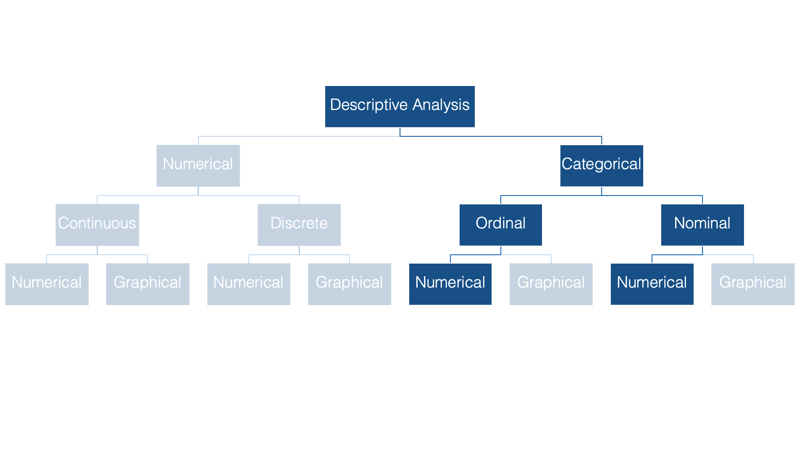
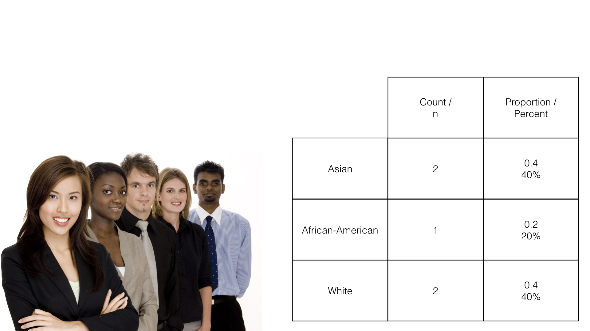

```{r setup, include=FALSE}
knitr::opts_chunk$set(echo = TRUE)
```

# Introduction

We’ll begin our discussion of descriptive statistics in the categorical half of our flow chart. Specifically, we’ll start by numerically describing categorical variables. As a reminder, categorical variables are variables whose values fit into categories.



Some examples of categorical variables commonly seen in public health data are: sex, race or ethnicity, and level of educational attainment.


Notice that there is no inherent numeric value to any of these categories. Having said that, we can, and often will, assign a numeric value to each category using R.


The two most common numerical descriptions of categorical variables are probably the frequency count (you will often hear this referred to as the n) and the proportion or percentage.



The count is simply the number of observations, in this case people, which fall into each possible category.

The proportion is just the count divided by the total number of observations. In this example, 2 people out of 5 people (40%) are Asian.

Now let’s go over _how_ to calculate frequency counts and percentages using R.

# Height and Weight Data

Below, we're going to learn to do descriptive analysis in R by experimenting with some simulated data that contains several people's sex, height, and weight. You can follow along with this lesson by copying and pasting the code chunks below in your R session.

```{r message=FALSE}
# Load the tidyverse package to make our code easier to read
library(tidyverse)
```

```{r}
# Simulate some data
height_and_weight_20 <- tibble(
  id     = c("001", "002", "003", "004", "005", "006", "007", "008", "009", 
             "010", "011", "012", "013", "014", "015", "016", "017", "018", 
             "019", "020"),
  sex    = c("Male", "Male", "Female", "Female", "Male", "Male", "Female", "Male", 
             "Female", "Male", "Male", "Female", "Female", "Female", "Male", 
             "Female", "Female", "Female", "Female", 'Female'),
  ht_in  = c(71, 69, 64, 65, 73, 69, 68, 73, 71, 66, 71, 69, 66, 68, 75, 69, 
             66, 65, 65, 65),
  wt_lbs = c(190, 176, 130, 154, 173, 182, 140, 185, 157, 155, 213, 151, 147, 
             196, 212, 190, 194, 176, 176, 102)
)
```


## View the data

Let's start our analysis by taking a quick look at our data...

```{r}
height_and_weight_20
```

**Here's what we did above:**   

* Simulated some data that we can use to practice categorical data analysis.

* We viewed the data and found that it has 4 variables (columns) and 20 observations (rows).


# Calculating frequencies

Now that we’re able to easily view or data, let’s return to the original purpose of this demonstration – calculating frequencies and proportions. At this point, I suspect that few of you would have any trouble telling me that the frequency of females in this data is 12 and the frequency of males in this data is 8. It's pretty easy to just count the number of females and males in this small dataset with only 20 rows. Further, if I asked you what proportion of this sample is female, most of you would still be able to easily tell me `12/20 = 0.6`, or 60%. But, what if we had 100 observations or 1,000,000 observations? You’d get sick of counting pretty quickly. Fortunately, you don’t have to.

As is always the case with R, there are multiple ways we can calculate the statistics that we're interested in -- frequencies at the moment. For example, we can use the base R `table` function like this:

## The base R table function

```{r}
table(height_and_weight_20$sex)
```

Additionally, we can use the `CrossTable` function from the `gmodels` package, which gives us a little more information by default:

## The gmodels CrossTable function

```{r}
gmodels::CrossTable(height_and_weight_20$sex)
```

## The tidyverse way

The final way I'm going to discuss here is the `tidyverse` way, which is my preference. We will have to write a little additional code, but the end result will be more flexible, more readable, and will return our statistics to us in a data frame that we can save and use for further analysis. Let's walk through this step by step...

<div class="more-info">
  <p>The pipe operator: You should already be familiar with the pipe operator (`%>%`), but if it doesn't look familiar to you, you can learn more about it [here](https://r4ds.had.co.nz/pipes.html)</p>
  <p>If you are using RStudio, you can use the keyboard shortcut `shift + command + m` to type the pipe operator</p>
</div>

First, we don't want to view the individual values in our data frame. Instead, we want to condense those values into summary statistics. This is a job for the [summarise()](https://dplyr.tidyverse.org/reference/summarise.html) function. 

```{r}
height_and_weight_20 %>% 
  summarise()
```

As you can see, `summarise()` doesn't do anything interesting on its own. We need to tell it what kind of summary information we want. We can use the [n()](https://dplyr.tidyverse.org/reference/n.html) function to count rows. By, default, it will count all the rows in the data frame. For example:

```{r}
height_and_weight_20 %>% 
  summarise(n())
```

So, what we've done above is pass our entire data frame to R and asked R to count the number of rows in the data frame. The result we get from R is a new data frame with 1 column (named `n()`) and one row with the value 20 (the number of rows in the original data frame).

This is a great start. However, we really want to count the number of rows that have the value "female" for sex, and then separately count the number of rows that have the value "male" for sex. Said another way, we want to break our data frame up into smaller data frames -- one for each value of `sex` -- and then count the rows. This is exactly what `dplyr`'s [group_by()](https://dplyr.tidyverse.org/reference/group_by.html) function does.


```{r}
height_and_weight_20 %>%
  group_by(sex) %>% 
  summarise(n())
```

And, that's what we want.

However, it will be awkward to work with a variable named `n()` in the future. Let's go ahead and assign it a different name. We can assign it any name we want. Some names that might make sense are n, frequency, or count. I'm going to go ahead an just name it `n` without the parentheses.

```{r}
height_and_weight_20 %>%
  group_by(sex) %>% 
  summarise(n = n())
```

Finally, estimating categorical frequencies like this is such a common operation that `dplyr` has a shortcut for it. We can use the [count](https://dplyr.tidyverse.org/reference/tally.html) function to get the same result that we got above.

```{r}
height_and_weight_20 %>% count(sex)
```


# Calculating percentages

In addition to frequencies, we will often be interested in calculating percentages for categorical variables. As always, there are many was to accomplish this in R. From here on out, I'm going to use the `tidyverse` functions. 

In this case, the proportion of people in our data who are female can be calculated as the number who are female (12) divided by the total number of people in the data. We already know that there are 20 people in the data, so we could calculate proportions like so:

```{r}
height_and_weight_20 %>% 
  count(sex) %>% 
  mutate(prop = n / 20)
```

**Here's what we did above:**   

* Because the `count()` function returns a data frame just like any other data frame, we can manipulate it in the same ways we can manipulate any other data frame.    

* So, we used `dplyr`'s [mutate()](https://dplyr.tidyverse.org/reference/mutate.html) verb to create a new variable in the data frame named `prop`. Again, we could have named it anything.   

* Then we set the value of `prop` to be equal to the value of `n` divided by 20.

This works, but it would be better to have R calculate the total number of observations for the denominator (20) than for us to manually type it in. In this case, we can do that with the `sum()` function.

```{r}
height_and_weight_20 %>% 
  count(sex) %>% 
  mutate(prop = n / sum(n))
```

**Here's what we did above:**

* Instead of manually typing in the total count for our denominator (20), we had R calculate it for us using the `sum()` function. The `sum()` function added together all the values of the variable `n` (i.e., 12 + 8 = 20).

Finally, we just need to multiply our proportion by 100 to convert it to a percentage.

```{r}
height_and_weight_20 %>% 
  count(sex) %>% 
  mutate(percent = n / sum(n) * 100)
```

**Here's what we did above:**

* Changed the name of the variable we are creating from `prop` to `percent`. But, we could have named it anything.

* Multiplied the proportion by 100 to convert it to a percentage.


# Missing data

In the real world, you will frequently encounter data that has missing values. Let's quickly take a look at an example by adding some missing values to our data frame.

```{r}
height_and_weight_20 <- height_and_weight_20 %>% 
  mutate(sex = replace(sex, c(2, 9), NA)) %>% 
  print()
```

**Here's what we did above:**

* Replaced the 2nd and 9th value of sex with `NA` (missing)

Now let's see how our code from above handles this

```{r}
height_and_weight_20 %>% 
  count(sex) %>% 
  mutate(percent = n / sum(n) * 100)
```

As you can see, we are now treating missing as if it were a category of sex. Sometimes this will be the result you want. However, often you will want the n and percent of _non-missing_ values for your categorical variable. This is sometimes referred to as a _complete case analysis_. There's a couple of different ways we can handle this. I will simply filter out rows with a missing value for sex with `dplyr`'s [filter](https://dplyr.tidyverse.org/reference/filter.html) verb.

```{r}
height_and_weight_20 %>% 
  filter(!is.na(sex)) %>% 
  count(sex) %>% 
  mutate(percent = n / sum(n) * 100)
```

**Here's what we did above:**

* We used `filter()` to keep only the rows that have a _non-missing_ value for sex.

* Used our code from above to calculate the n and percent of non-missing values of sex.


# Formatting results

Notice that now our percentages are being displayed with 5 digits to the right of the decimal. If we wanted to present our findings somewhere (e.g., a journal article or a report for our employer) we would almost never want to display this many digits. Let's get R to round these numbers for us.

```{r}
height_and_weight_20 %>% 
  filter(!is.na(sex)) %>% 
  count(sex) %>% 
  mutate(percent = (n / sum(n) * 100) %>% round(2))
```

**Here's what we did above:**

* We used the `round()` function to round our percentages to 2 decimal places.


# Making code reusable

In the sections above, we learned how we can use the `dplyr` functions to calculate the frequency and percent of each category of a categorical variable. However, there is a fair amount of code writing involved. This would be tedious and error prone if we had to type it out many times. Luckily, you already learned a little bit about how writing your own functions in R solves both of those problems. 

<div class="more-info">
  <p>Refresher: <a href="https://r4ds.had.co.nz/functions.html target=_blank">R 4 Data Science, Chapter 19, Functions</a></p>
</div>

This looks like a great opportunity to write our own function. Let’s walk through it step-by-step.

First, let's start with the basic structure for creating any function in R...

```{r}
n_percent <- function() {

}
```

**Here's what we did above:**

* We created a function called `n_percent()`. Currently, the function takes no arguments and does nothing.

Next, let's copy our n and percent code from above and poste it into our empty function.

```{r}
n_percent <- function() {
  height_and_weight_20 %>% 
    filter(!is.na(sex)) %>% 
    count(sex) %>% 
    mutate(percent = (n / sum(n) * 100) %>% round(2))
}
```

**Here's what we did above:**

* We added code to the body of `n_percent()`. However, the code above still isn't reusable. 

<div class="more-info">
  If you still have the height_and_weight data frame loaded, then when you run `n_percent()` you should get the same n and percent for males and females that we got earlier. 
  
  If you don't have the height_and_weight data frame loaded, then you should get an error when you run `n_percent()` that says something like, "Error in eval(lhs, parent, parent) : object 'height_and_weight_20' not found"
</div>

Now, let's make this function more flexible.

## Use our function with other data frames

The data frame "height_and_weight_20" is hard coded into the body of the function we wrote above. That means that we can't currently use our function with any other data frame, which completely defeats the purpose of what we're trying to do. Below, we will add a parameter to our function that will allow us to "pass" any data frame into the body of our function.

```{r}
n_percent <- function(df) {
  df %>% 
    filter(!is.na(sex)) %>% 
    count(sex) %>% 
    mutate(percent = (n / sum(n) * 100) %>% round(2))
}
```

```{r}
n_percent(height_and_weight_20)
```

**Here's what we did above:**

* We added a parameter -- `df` -- to our `n_percent()` function.

* We replaced `height_and_weight_20` in the body of our function with the `df` parameter.

* That parameter can now accept any data frame as an argument and "pass" that data frame to the rest of our code inside the function. So, now we can use the `n_percent()` function on any data frame.

* However, the variable `sex` is still hard coded into our function. Meaning we are still telling the `filter()` function and `count()` function to look for a variable called `sex`.

## Use our function with other variables

Next, let's add another parameter to our function that will allow us to "pass" any variable to the code inside our function -- not just `sex`.

```{r}
n_percent <- function(df, x) {
  
  # Use equo to convert x into a "quoture"
  x <- enquo(x)
  
  df %>% 
    filter(!is.na(!!x)) %>% # Use "!!" because x is a quoture
    count(!!x) %>%          # Use "!!" because x is a quoture
    mutate(percent = (n / sum(n) * 100) %>% round(2))
}
```

```{r}
n_percent(height_and_weight_20, sex)
```

**Here's what we did above:**

* We added a parameter -- `x` -- to our `n_percent()` function.

* We replaced `sex` in the body of our function with the `x` parameter.

* That parameter can now accept any variable in the data frame as an argument.

## Tidy evaluation

You may notice that we used two new functions -- `enquo()` and `!!` -- in the latest version of our `n_percent()` function. These functions are part of the tidy evaluation package, which is beyond the scope of this lesson. [However, those of you who would like to learn more about tidy evaluation can click here](https://tidyeval.tidyverse.org/). 

Many of you will find tidy evaluation confusing. I still get confused by tidy evaluation sometimes. But, hang in there with me for a second.

* We need to use tidy evaluation functions whenever we use `dplyr` functions inside the body of the functions we are writing.

* Specifically, we need to use `equo()` to convert variables into something called "quotures" and we must then use the `!!` notation in front of those quotures anywhere in our code that we want to use them like variables.

**If the whole tidy evaluation thing is really throwing you for a loop, then you have a couple options:**

1. You can just use `enquo()` and `!!` now in the way I demonstrated above even though you don't really understand _why_ you are using them.

2. You can continue to write out the code from above manually without writing your own functions at this point. For example: 

```{r eval=FALSE}
height_and_weight_20 %>% 
  filter(!is.na(sex)) %>% 
  count(sex) %>% 
  mutate(percent = (n / sum(n) * 100) %>% round(2))
```

3. You can make sure not to use any `dplyr` functions inside the body of the functions you write. For example:

```{r}
n_percent_2 <- function(x) {
  x               <- x[!is.na(x)]                       # Filter out missing
  results         <- data.frame(categories = unique(x)) # Create data frame to contain calculations
  results$n       <- as.numeric(table(x))               # Get counts
  results$percent <- results$n / sum(results$n) * 100   # Calculate percent
  results$percent <- round(results$percent, 2)          # Round to two decimal places
  results                                               # Print out results
}

n_percent_2(height_and_weight_20$sex)
```

**For now, I suggest option 1 or 2 above for most of you. However, these are all just different means to the same end. Ultimately, the "best" method is the one that works "best" for you.**

Finally, for demonstration purposes, I'll load the built-in `mtcars` data frame here and use the `n_percent()` function to do some calculations on it.

```{r}
# Load the built-in mtcars data frame
data("mtcars")
mtcars
```

```{r}
# Calculate n and percent of cyl manually
mtcars %>% 
  filter(!is.na(cyl)) %>% 
  count(cyl) %>% 
  mutate(percent = (n / sum(n) * 100) %>% round(2))
```

```{r}
# Now use our n_percent function
mtcars %>% 
  n_percent(cyl)
```

<!--
[Click here to continue](https://brad-cannell.github.io/course-Introduction-to-R-Programming-for-Epidemiologic-Research/graphical_descriptions_of_categorical_variables.html)
-->