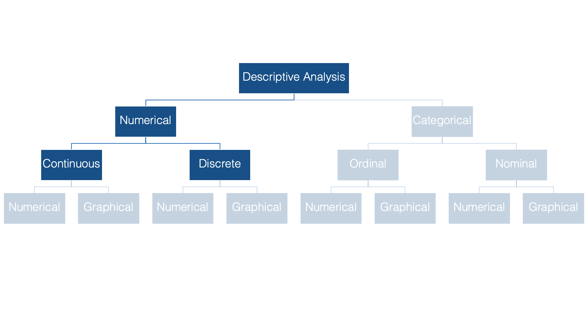
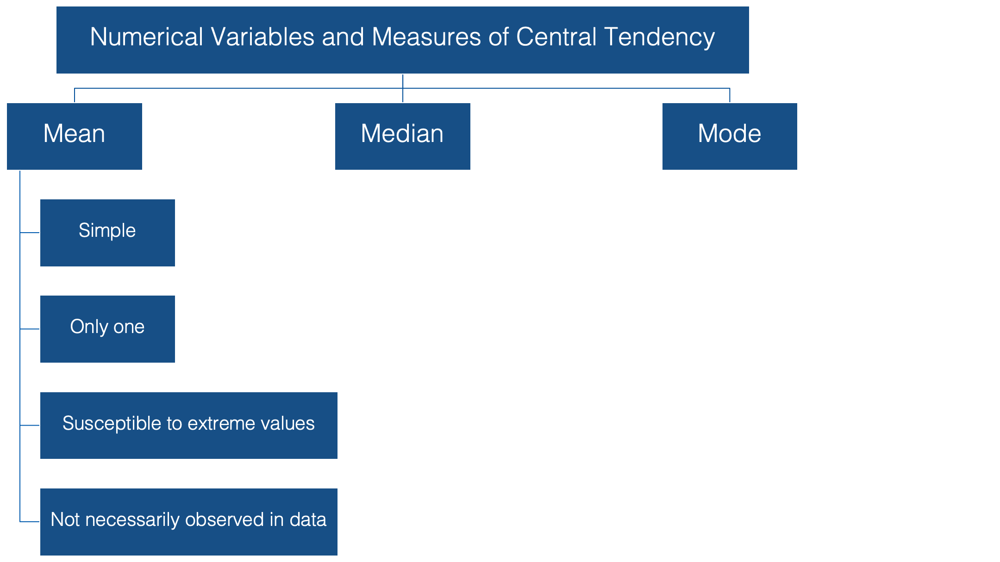
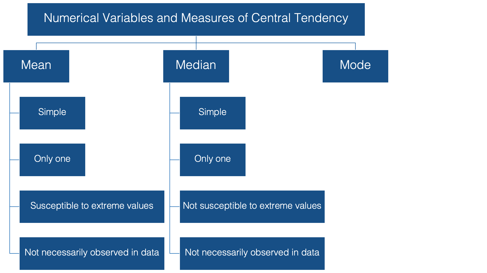
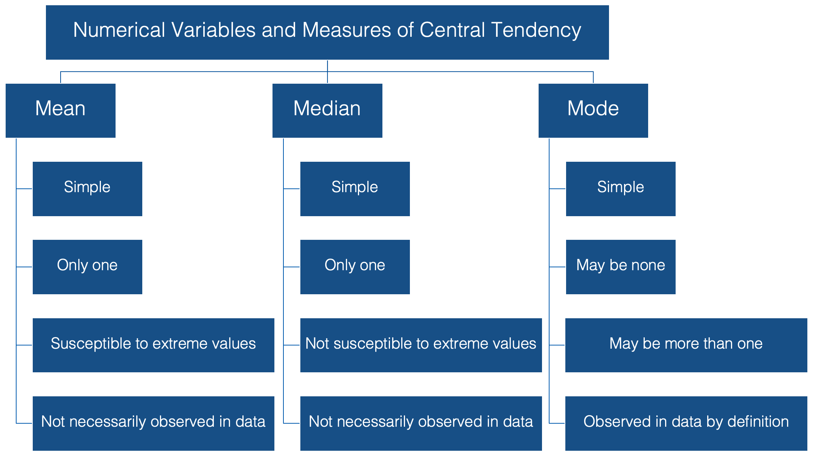

```{r setup, include=FALSE}
knitr::opts_chunk$set(echo = TRUE)
```

# Introduction

In previous sections you've seen methods for describing individual categorical variables. Now we’ll switch over to describing numerical variables.



The most basic, and probably most commonly used way to describe the typical person in a population with respect to some characteristic that is recorded as a numerical variable, like height or weight, is with a measure of central tendency.
In this lecture we’ll discuss three measures of central tendency:

* The mean

* The median

* And the mode


Now, this is not a statistics course, but here we briefly discuss these measures and some of their characteristics to make sure that we’re all on the same page when we discuss interpretation of our results.

## The mean



When we talk about the typical, or “average”, value of some variable measured on a continuous scale, we are usually talking about the mean value of that variable, and to be even more specific we are usually talking about the arithmetic mean value. And this value has some favorable characteristics that make it a good description of central tendency.

1. For starters it’s simple. Most people are familiar with the mean, and at the very least, have some intuitive sense of what it means (no pun intended). 

2. In addition, for any set of values, there can be only one mean value. 

However, there are a couple of potentially problematic characteristics of the mean as well: 

1. It’s susceptible to extreme values in your data. In other words, a couple of people with very atypical values for the characteristic you are interested in, can drastically alter the value of the mean, and your estimate for the typical person in your population of interest along with it. <!-- Code an example -->

2. Additionally, it’s very possible to calculate a mean value that is not actually observed anywhere in your data. For instance, the mean weight for our class could be 133 pounds even if nobody in the class actually weighs 133 pounds. <!-- Code an example -->

<div class="more-info">
Note: The sample mean is often referred to as $\bar{x}$, which pronounced "x bar."
</div>

## The median



The median is probably the second most commonly used measure of central tendency and like the mean it’s computationally simple and relatively straightforward to understand. There can be one, and only one, median. And, its value may also be unobserved in the data.

However, unlike the mean, it’s relatively resistant to extreme values<!-- Code an example -->. In fact, when the median is used as the measure of central tendency, it’s often because the person conducting the analysis suspects that extreme values in the data are likely to distort the mean.

## The mode



And finally, we have the mode, or the value that is most often observed in the data. It doesn’t get much simpler than that. But, unlike the mean and the median, there can be more than one mode for a given set of values. In fact, there can even be no mode if all the values are observed the exact same number of times.

However, if there is a mode, by definition it’s observed in the data.

Now that we are all on the same page with respect to the fundamentals of central tendency, let’s take a look at how to calculate these measures using R.

# Calculate the mean

Calculating the mean is really straightforward. We can just use base R's built-in `mean()` function.

```{r message=FALSE}
# Load the Tidyverse package
library(tidyverse)
```

```{r}
# Simulate some data
height_and_weight_20 <- tribble(
  ~id,   ~sex,     ~ht_in, ~wt_lbs,
  "001", "Male",   71,     190,
  "002", "Male",   69,     177,
  "003", "Female", 64,     130,
  "004", "Female", 65,     153,
  "005", NA,       73,     173,
  "006", "Male",   69,     182,
  "007", "Female", 68,     186,
  "008", NA,       73,     185,
  "009", "Female", 71,     157,
  "010", "Male",   66,     155,
  "011", "Male",   71,     213,
  "012", "Female", 69,     151,
  "013", "Female", 66,     147,
  "014", "Female", 68,     196,
  "015", "Male",   75,     212,
  "016", "Female", 69,     19000,
  "017", "Female", 66,     194,
  "018", "Female", 65,     176,
  "019", "Female", 65,     176,
  "020", "Female", 65,     102
)
```

```{r}
mean(height_and_weight_20$ht_in)
```

**Here's what we did above:**

* We started by simulating some data. Heights and weights for 20 hypothetical students.

* Next, we used base R's `mean()` function to calculate the mean of the column "ht_in" from the data frame "height_and_weight_20".

  - Note: if you just type `mean(ht_in)` you will get an error. That's because R will look for an object called "ht_in" in the global environment. 
  
  - However, we didn't create an object called "ht_in". We created an object (in this case a data frame) called "height_and_weight_20". That object has a column in it called "ht_in".

  - So, we must specifically tell R to look for the "ht_in" column in the data frame "height_and_weight_20". Using base R, we can do that in one of two ways: `height_and_weight_20$ht_in` or `height_and_weight_20[["ht_in"]]`.
  
# Calculate the median

Similar to above, we can use base R's `median()` function to calculate the median.

```{r}
median(height_and_weight_20$ht_in)
```

**Here's what we did above:**

* We used base R's `median()` function to calculate the modian of the column "ht_in" from the data frame "height_and_weight_20".

# Calculate the mode

Base R does not have a built-in `mode()` function. Well, it actually does have a `mode()` function, but for some reason that function does not return the mode value(s) of a set of numbers. Instead, the `mode()` function gets or sets the type or storage mode of an object. For example:

```{r}
mode(height_and_weight_20$ht_in)
```

This is clearly not what we are looking for. So, how do we find the mode value(s)? Well, we are going to have to build our own mode function. I'll start at the final result -- our mode function. Then, I'll walk you through how I built it one step at a time. Keep in mind, as is almost always the case with R, my way of writing this function is only one of multiple possible ways.

```{r}
mode_val <- function(x) {
  
  # Count the number of occurrences for each value of x
  value_counts <- table(x)
  
  # Get the maximum number of times any value is observed
  max_count <- max(value_counts)
  
  # Create and index vector that identifies the positions that correspond to
  # count values that are the same as the maximum count value: TRUE if so
  # and false otherwise
  index <- value_counts == max_count
  
  # Use the index vector to get all values that are observed the same number 
  # of times as the maximum number of times that any value is observed
  unique_values <- names(value_counts)
  result <- unique_values[index]
  
  # If result is the same length as value counts that means that every value
  # occured the same number of times. If every value occurred the same number
  # of times, then there is no mode
  no_mode <- length(value_counts) == length(result)
  
  # If there is no mode then change the value of result to NA
  if (no_mode) {
    result <- NA
  }
  
  # Return result
  result
}
```

```{r}
mode_val(height_and_weight_20$ht_in)
```

**Here's what we did above:**

* We created our own function, `mode_val()`, that takes a vector (or data frame column) as an argument to its "x" parameter, and returns the mode value(s) of that vector.

* We can also see that the function works as expected when there is more than one mode value. In this case, "65" and "69" each occur 4 times in the column "ht_in". 

Now that we created our mode function, let's test to make sure it also works when there is only one mode value and when there is no mode value.

```{r}
# Test data for one mode value
one_mode <- c(1, 1, 2, 3, 4)
```

```{r}
# Should return 1
mode_val(one_mode)
```

```{r}
# Test data for no mode value
no_mode <- c(1, 2, 3, 4, 5)
```

```{r}
# Should return NA
mode_val(no_mode)
```

**Here's what we did above:**

* We tested our function, `mode_val()`, on a vector with one mode value and a vector with no mode value. We got the results we expected.

* Now you may want to save this function somewhere so that you can use it again in the future if you need to.

## Dissecting our mode function

You may have already figured out how our `mode_val()` function works by just looking through the comments I put inside the function. If so, great! If not, I walk through how it works step-by-step in this section.

First, we used the `table()` function to return a contingency table. A numeric vector that includes each unique value of "ht_in" along with the number of times each value occurs.

```{r}
# Count the number of occurrences for each value of x
value_counts <- table(height_and_weight_20$ht_in)
value_counts
```

Just looking at the contingency table above, you can see that the largest number of occurrences is 4. In other words, 4 students had a height of 65" and 4 students had a height of 69". If this were our real data, we would probably just stop here. We have our answer. However, it would be tedious and error-prone to manually check for the mode value this way if our real data included many more possible values.

Second, we figured out what the maximum number of times any value occurred. 

```{r}
# Get the maximum number of times any value is observed
max_count <- max(value_counts)
max_count
```

Third, we created an index vector that is the same length as "value_counts" (i.e. 8). The index vector has a value of TRUE in each position were "value_counts" is equal to "max_count" (i.e. 4).

```{r}
# Create and index vector that identifies the positions that correspond to
# count values that are the same as the maximum count value: TRUE if so
# and false otherwise
index <- value_counts == max_count
index
```

Fourth, we use that index vector to keep only the values of "ht_in" that were observed 4 times -- where "index" is TRUE.

```{r}
unique_values <- names(value_counts)
unique_values
```

```{r}
result <- unique_values[index]
result
```

We could stop here if we didn't have to worry about vectors that don't have a mode value. However, if we want our function to be as complete as possible, we should make sure it intelligently handles vectors that don't have a mode value.

We will do that below using a conditional statement. If you need a refresher on conditional statements, you may want to work through [Intermediate R, Chapter 1: Conditionals and Control Flow](https://www.datacamp.com/courses/intermediate-r) again.

So, the fifth step is to test the equality of the lengths of "value_counts" and "result". At this point in our function "value_counts" is a vector that includes each unique value of "ht_in" along with the number of times each value occurs. Result is a vector that includes only the values of "ht_in" that were observed the same number of times as the maximum number of times any value was observed -- in this case, 4. So, the lengths of "value_counts" and "result" are:

```{r}
length(value_counts)
```

```{r}
length(result)
```

And therefore...

```{r}
length(value_counts) == length(result)
```

And therefore...

```{r}
# If result is the same length as value counts that means that every value
# occured the same number of times. If every value occurred the same number
# of times, then there is no mode
no_mode <- length(value_counts) == length(result)
no_mode
```

But, what would happen in a case where each value appeared exactly one time?

```{r}
ht_in_same <- c(68, 69, 70,71,72)
value_counts_same <- table(ht_in_same)
max_count_same <- max(value_counts_same)
index_same <- value_counts_same == max_count_same
unique_values_same <- names(value_counts_same)
result_same <- unique_values_same[index_same]
```

```{r}
value_counts_same
```

```{r}
result_same
```

```{r}
length(value_counts_same) == length(result_same)
```

As you can see, whenever each value appears the same number of times (in this case one time each) the length of "value_counts" and "result" will be equal. In that case (i.e. "no_mode" is TRUE), we want to overwrite the value of result to be NA (missing). In other words, when all values appear the same name of times, there is no mode value -- it is missing.

**Here's what we did above:**

* We broke down our `mode_val()` function into its component parts. We viewed what each part does and how it ultimately contributes to a working function. 

* This version of the `mode_val()` function was especially long an verbose. I did this intentionally to help make it easier to understand how it works. And in this case, that really isn't a problem. However, you can try rewriting this function in a more succinct way if you want to challenge yourself.

# Compare mean, median, and mode

<!-- This isn't HOW to get the mean. This a comparison of the mean and the median - the WHY -->

Now that you know how to calculate the mean, median, and mode, let's compare these three measures of central tendency. This is a good opportunity to demonstrate some of the different characteristics of each that we spoke about earlier.

```{r}
height_and_weight_20 %>% 
  summarise(
    min_weight    = min(wt_lbs),
    mean_weight   = mean(wt_lbs),
    median_weight = median(wt_lbs),
    mode_weight   = mode_val(wt_lbs) %>% as.double(),
    max_weight    = max(wt_lbs)
  )
```

**Here's what we did above:**

* We used the `mean()` function, `median()` function, and our `mode_val()` function inside of dpylr's `summarise()` function to find the mean, median, and mode values of the column "wt_lbs" in the "height_and_weight_20" data frame.

* We also used the `as.double()` function to convert the value returned by `mode_val()` -- "176" -- from a character string to a numeric double. This isn't strictly necessary, but I think it looks better.

* Finally, we used base R's `min()` and `max()` functions to view the lowest and highest weights in our sample. 

## Data checking

Do you see any red flags 🚩as you scan the results? Do you really think a mean weight of 1,113 pounds sounds reasonable? This should definitely be a red flag for you. Now move your gaze three columns to the right and notice that the maximum value of weight is 19,000 lbs – an impossible value for a study in human populations. In this case the real weight was supposed to be 190 pounds, but the person entering the data accidently got a little trigger-happy with the zero key. This is an example of what I meant when I said "We can use descriptive analysis to uncover errors in our data" in the [Introduction to Descriptive Analysis lesson](00_introduction.nb.html). Often times, for various reasons, some observations for a given variable take on values that don’t make sense. Starting by calculating some basic descriptive statistics for each variable is one approach you can use to try to figure out if you have values in your data that don’t make sense.

In this case we can just go back and fix our data, but what if we didn’t know this value was an error? What if it were a value that was technically possible, but very unlikely? Well, we can’t just go changing values in our data. It’s unethical, and in some cases illegal. Below, we discuss the how the properties of the median and mode can come in handy in situations such as this.

## Properties of mean, median, and mode 

Despite the fact that this impossibly extreme value is in our data, the median and mode estimates are reasonable estimates of the average person’s weight in this sample. This is what I meant when I said that the median and mode were more “resistant to extreme values” than the mean. 

You may also notice that no person in our sample had an actual weight of 1,112.75 (the mean) or even 176.5 (the median). This is what I meant above when I said that the mean and median values are “not necessarily observed in the data.”

In this case, the mode value (176) is also a more reasonable estimate of the average person's weight than the mean. And unlike the mean and the median, participants 18 and 19 actually weigh 176 pounds. I'm __not__ saying that the mode is always the best measure of central tendency to use. I __am__ saying that you can often learn useful information from your data by calculating and comparing these relatively simple descriptive statistics on each of your numeric variables.
