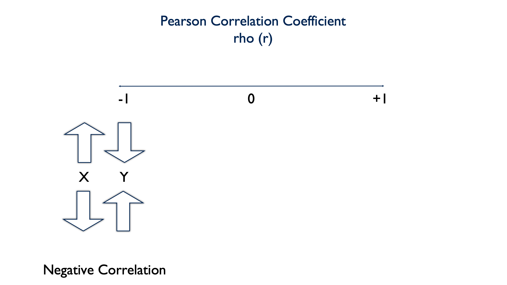

```{r setup, include=FALSE}
knitr::opts_chunk$set(echo = TRUE)
```

# Introduction

Before covering anything new, let’s quickly review the importance and utility of descriptive analysis. 

1. We can use descriptive analysis to uncover errors in our data

2. It helps us understand the distribution of values in our variables

3. Descriptive analysis serve as a starting point for understanding relationships between our variables

In the first few lessons on descriptive analysis we covered performing __univariate__ analysis. That is, analyzing a single numerical or a single categorical variable. In this module, we’ll learn methods to describe relationships __between__ two variables. This is also called __bivariate__ analysis. 

For example, we may be interested in knowing if there is a relationship between heart rate and exercise. If so, we may ask ourselves if heart rate differs, on average, by daily minutes of exercise. And, we could answer that question with the using a bivariate descriptive analysis.

<!-- Add picture of exercise and heart rate -->

Before performing any such bivariate descriptive analysis, you should ask yourself what types of variables you will analyze. We’ve already discussed the difference between numerical variables and categorical variables, but we will also need to decide whether each variable is an outcome or a predictor.

**The variable whose value we are attempting to predict, estimate, or determine is the outcome variable.** The outcome variable may also be referred to as the dependent variable or the response variable.

**The variable that we think will determine, or at least help us predict, the value of the outcome variable is called the predictor variable.** The predictor variable may also be referred to as the independent variable or the explanatory variable.


So going back to our interest in whether or not heart rate differs by daily minutes of exercise. In this scenario which variable is the predictor and which is the outcome?

In this scenario daily minutes of exercise is the predictor and heart rate is the outcome.

<!-- Make that  more clever somehow. Hide it or make slide or something -->
<!-- https://rstudio.github.io/learnr/questions.html -->

Heart rate is the variable we’re interested in predicting or understanding, and exercise is a variable that we think helps to predict or explain heart rate.

In this first lesson on bivariate analysis we will learn a simple method for describing the relationship between a continuous outcome variable and a continuous predictor variable such as heart rate and minutes of daily exercise -- the Pearson Correlation Coefficient.


# Pearson Correlation Coefficient

Pearson’s Correlation Coefficient is a parametric measure of the __linear__ relationship between two numerical variables. It’s also referred to as rho (pronounced like "row") and can be written shorthand as a lowercase $r$. The Pearson Correlation Coefficient can take on values between -1 and 1, including zero. 


A value of 0 indicates that there is no correlation between the two variables. 


A negative value indicates that there is a negative correlation between the two variables. In other words, as the value of x increases, the value of y decreases. Or, as the value of x decreases, the value of y increases.



A positive value indicates that there is a positive correlation between the two variables. As the value of x increases, the value of y increases. Or as the value of x decreases, the value of y decreases.


**A note of caution:** When the relationship between two variables is nonlinear or when outliers are present, the correlation coefficient might incorrectly estimate the strength of the relationship. Plotting the data enables you to verify the linear relationship and to identify the potential outliers.

<!-- show an example -->

## Calculating r

In this first code chunk, we’re going to use some simple simulated data to develop an intuition about describing the relationship between two continuous variables.

```{r message=FALSE}
# Load the Tidyverse package
library(tidyverse)
```

```{r}
set.seed(123)
df <- tibble(
  id = 1:20,
  x  = sample(x = 0:100, size = 20, replace = TRUE),
  y  = sample(x = 0:100, size = 20, replace = TRUE)
)
df
```

**Here's what we did above:**   

* We created a data frame with 3 simulated variables -- id, x, and y.

* We used the `sample()` function to create x and y by sampling a number between 0 and 100 at random, 20 times. 

* The `replace = TRUE` option tells R that the same number can be selected more than once.

* The `set.seed()` function is to ensure that I get the same random numbers every time I run the code chunk. 

There is nothing special about 0 and 100; they are totally arbitrary. But, because all of these values are chosen at random, we have no reason to believe that there should be any relationship between them. Accordingly, we should also expect the Pearson Correlation Coefficient to be 0 (or very close to it).

In order to develop an intuition, let’s first plot this data, and get a feel for what it looks like.

```{r}
ggplot(df, aes(x, y)) +
  geom_point() +
  theme_bw()
```

Above, we've created a nice scatter plot using `ggplot2()`. But, how do we interpret it? Well, each dot corresponds to a person in our data at the point where their x value intersects with their y value. This is made more clear by adding a `geom_text()` layer to our plot. 

```{r}
ggplot(df, aes(x, y)) +
  geom_point() +
  geom_text(aes(label = id), nudge_x = 1.5, nudge_y = 2) +
  theme_bw()
```

**Here's what we did above:**

* We added a `geom_text()` layer to our plot in order to make it clear which person each dot reprsents. 

* The `nudge_x = 1.5` option moves or text (the id number) to the right 1.5 units. The `nudge_y = 2` option moves our text 2 units up. We did this to make the id number easier to read. If we had not nudged them, they would have been placed directly on top of the points.

For example, person 1 in our simulated data had an x value of 30 and a y value of 24. When you look at the plot above, does it look like person 1's point is approximately at (x = 30, y = 71)? If we want to emphasize the point even further, we can plot a vertical line at x = 30 and a horizontal line at y = 71. Let's do that below.

```{r}
ggplot(df, aes(x, y)) +
  geom_text(aes(label = id), nudge_x = 1.5, nudge_y = 2) +
  geom_vline(xintercept = 30, col = "red", size = 0.25) +
  geom_hline(yintercept = 71, col = "red", size = 0.25) +
  geom_point() +
  theme_bw()
```

As you can see, the dot representing id 1 is at the intersection of these two lines.

So, we know how to read the plot now, but we still don’t really know anything about the __relationship__ between x and y. Remember, we want to be able to characterize x and y as having one of these 5 relationships:


Looking again at our scatter plot, which relationship do you think x and y have? 

```{r}
ggplot(df, aes(x, y)) +
  geom_point() +
  geom_text(aes(label = id), nudge_x = 1.5, nudge_y = 2) +
  geom_point(aes(x, y), data.frame(x = 100, y = 80), shape = 1, size = 16, col = "red") +
  geom_point(aes(x, y), data.frame(x = 90, y = 8), shape = 1, size = 16, col = "blue") +
  theme_bw()
```

Well, if you look at id 9 above, x is a high number (100) and y is a high number (80). But if you look at id 15, x is a high number (90) and y is a low number (8). In other words, these dots are scattered all over the chart area. There doesn’t appear to be much of a pattern, trend, or relationship. And that’s exactly what we would expect from randomly generated data. 

Now that we know what this data looks like, and we intuitively feel as though x and y are unrelated, it would be nice to quantify our results in some way. And, that is precisely what the Pearson Correlation Coefficient does.

```{r}
cor.test(x = df$x, y = df$y)
```

**Here's what we did above:**

* By default, R's `cor.test()` function gives us a list of information about the relationship between x and y. The very last number in the output (-0.1406703) is the Pearson Correlation Coefficient. 

* The fact that this value is negative (between -1 and 0) tells us that x and y tend to vary in opposite directions.

* The numeric value (0.1406703) tells us something about the strength of the relationship between x and y. In this case, the relationship is not strong -- exactly what we expected. 

  - You will sometimes hear rules of thumb for interpreting the strength of $r$ such as[@Field2013-zo]: 
  
      - ±0.1 = Weak correlation
      
      - ±0.3 = Medium correlation
      
      - ±0.5 = Strong correlation
      
  - Rules of thumb like this are useful as you are learning; however, you want to make sure you don't become overly reliant on them. As you get more experience, you will want to start interpreting effect sizes in the context of your data and the specific research question at hand.

* The p-value (0.5542) tells us that we'd be pretty likely to get the result we got even if there really were no relationship between x and y -- __assuming all other assumptions are satisfied and the sample was collected without bias.__

* Taken together, the weak negative correlation and p-value tell us that there is not much -- if any -- relationship between x and y. Another way to say the same thing is, "x and y are statistically independent."

# Correlation intuition

To further bolster our intuition about these relationships, let’s look at a few positively and negatively correlated variables.

```{r}
# Positively correlated data
tibble(
  x = 1:10,
  y = 100:109,
  r = cor(x, y)
) %>% 
  ggplot() +
    geom_point(aes(x, y)) +
    geom_text(aes(x = 2.5, y = 107.5, label = paste("r = ", r)), col = "blue") +
    theme_classic()
```

Above, we created positively correlated data. In fact, this data is perfectly positively correlated. That is, every time the value of x increases, the value of y increases by a proportional amount. Now, instead of being randomly scattered around the plot area, the dots line up in a perfect, upward-sloping, diagonal line. I also, went ahead and added the correlation coefficient directly to the plot. As you can see, it is exactly 1. This is what you should expect from perfectly positively correlated data.

How about this next data set? Now, every time x decreases by one, y decreases by one. Is this positively or negatively correlated data?

```{r}
df <- tibble(
  x = 1:-8,
  y = 100:91
)
df
```

```{r}
df %>% 
  mutate(r = cor(x, y)) %>% 
  ggplot() +
      geom_point(aes(x, y)) +
      geom_text(aes(x = -6, y = 98, label = paste("r = ", r)), col = "blue") +
      theme_classic()
```

This is still perfectly positively correlated data. The values for x and y are still changing in the same direction proportionatly. The fact that the direction is one of decreasing value makes no difference.

One last made up example here. This time, as x increases by one, y decreases by one. Let’s plot this data and calculate the Pearson Correlation Coefficient.

```{r}
tibble(
  x = 1:10,
  y = 100:91,
  r = cor(x, y)
) %>% 
  ggplot() +
    geom_point(aes(x, y)) +
    geom_text(aes(x = 7.5, y = 98, label = paste("r = ", r)), col = "blue") +
    theme_classic()
```

This is what perfectly negatively correlated data looks like. The dots line up in a perfect, downward-sloping, diagonal line, and when we check the value of rho, we see that it is exactly -1.

Of course, as you may have suspected, __in real life things are never this cut and dry__. Now let’s investigate the relationship between continuous variables using more realistic data.

In this demonstration I’m using data from a class survey I actually conducted in the past:

```{r}
class <- tibble(
  ht_in = c(70, 63, 62, 67, 67, 58, 64, 69, 65, 68, 63, 68, 69, 66, 67, 65, 
            64, 75, 67, 63, 60, 67, 64, 73, 62, 69, 67, 62, 68, 66, 66, 62, 
            64, 68, NA, 68, 70, 68, 68, 66, 71, 61, 62, 64, 64, 63, 67, 66, 
            69, 76, NA, 63, 64, 65, 65, 71, 66, 65, 65, 71, 64, 71, 60, 62, 
            61, 69, 66, NA),
  wt_lbs = c(216, 106, 145, 195, 143, 125, 138, 140, 158, 167, 145, 297, 146, 
             125, 111, 125, 130, 182, 170, 121, 98, 150, 132, 250, 137, 124, 
             186, 148, 134, 155, 122, 142, 110, 132, 188, 176, 188, 166, 136, 
             147, 178, 125, 102, 140, 139, 60, 147, 147, 141, 232, 186, 212, 
             110, 110, 115, 154, 140, 150, 130, NA, 171, 156, 92, 122, 102, 
             163, 141, NA)
)
```

Next, I’m going to use a scatter plot to explore the relationship between height and weight in this data.

```{r}
ggplot(class, aes(ht_in, wt_lbs)) +
  geom_jitter() +
  theme_classic()
```

Quickly, what do you think? Will height and weight be positively correlated, negatively correlated, or not correlated?

```{r}
cor.test(class$ht_in, class$wt_lbs)
```

The dots don’t line up in a perfectly upward – or downward – slope. But the general trend is still an upward slope. Additionally, we can see that height and weight are positively correlated because the value of the correlation coefficient is between 0 and positive 1 (0.5890576). By looking at the p-value (3.051e-07), we can also see that the probability of finding a correlation value this large or larger in our sample if the true value of the correlation coefficient in the population from which our sample was drawn is zero, is very small.

That’s quite a mouthful, right? In more relatable terms you can just think of it this way. According to our data, as height increase weight tends to increase as well. Our p-value indicates that it’s pretty unlikely that we would get this result by if there were truly no relationship in the population this sample was drawn from -- assuming it's an unbiased sample.

__Quick detour__: The p-value above is written in scientific notation, which you may not have seen before. I'll quickly show you how to basically disable scientific notation in R.

```{r}
options(scipen = 999)
cor.test(class$ht_in, class$wt_lbs)
```

**Here's what we did above:**

* We used the R global option `options(scipen = 999)` to display decimal numbers instead of scientific notation. Because this is a global option, it will remain in effect until your restart your R session. If you do restart your R session, you will have to run `options(scipen = 999)` again to disable scientific notation.

Finally, wouldn’t it be nice if we could draw a line through this graph that sort of quickly summarizes this relationship (or lack thereof). Well, that is exactly what an Ordinary Least Squares (OLS) regression line does.

To add a regression line to our plot, all we need to do is add a `geom_smooth()` layer to our scatterplot with the "method" argument set to "lm." Let’s do that below and take a look.

```{r}
ggplot(class, aes(ht_in, wt_lbs)) +
  geom_smooth(method = "lm") +
  geom_jitter() +
  theme_classic()
```

The exact calculation for deriving this line is beyond the scope of this lesson. In general, though, you can think of it as cutting through the middle of all of your points, and representing the average change in the y value given a one-unit change in the x value. So here, the upward slope indicates that, on average, as height (the x value) increases, so does weight (the y value). And that is completely consistent with our previous conclusions about the relationship between height and weight.

# References